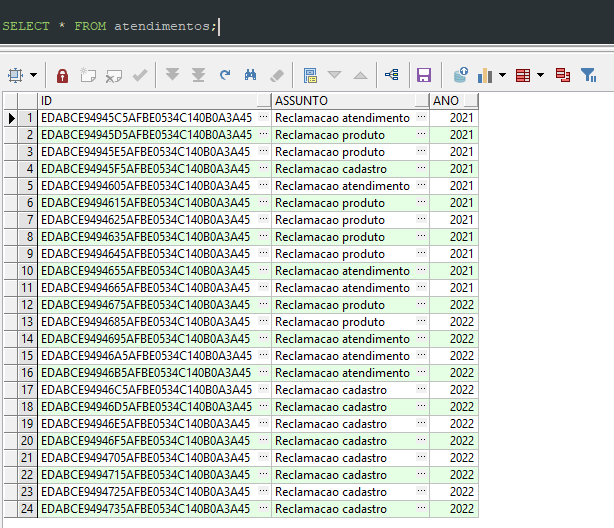
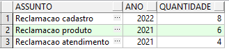
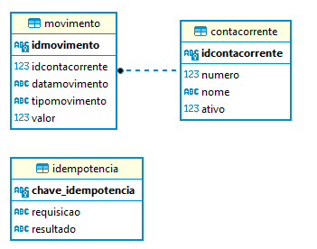

# Questão 1

Uma instituição financeira solicita que para cadastrar uma conta bancária, é necessário informar:

- o número da conta,
- o nome do titular da conta,
- e o valor de depósito inicial que o titular depositou ao abrir a conta.

O valor de depósito inicial, é opcional, ou seja:

- se o titular não tiver dinheiro a depositar no momento de abrir sua conta, o depósito inicial não será feito e o saldo inicial da conta será, naturalmente, zero.

**Importante:** Após a conta ser aberta, o número da conta nunca poderá ser alterado. Já o nome do titular pode ser alterado (pois uma pessoa pode mudar de nome quando contrai matrimônio por exemplo).

O saldo da conta não pode ser alterado livremente. É preciso haver um mecanismo para proteger isso.

O saldo só aumenta por meio de depósitos, e só diminui por meio de saques.

Para cada saque realizado, a instituição cobra uma taxa de $ 3.50.

Observação: a conta pode ficar com saldo negativo se o saldo não for suficiente para realizar o saque e/ou pagar a taxa.

Disponibilizamos um programa que solicita os dados de cadastro da conta, dando opção para que seja ou não informado o valor de depósito inicial. Em seguida, realizar um depósito e depois um saque, sempre mostrando os dados da conta após cada operação.

Você deve implementar a classe "**ContaBancaria**" para que o programa funcione conforme dois cenários de teste abaixo:

**Exemplo 1:**

Entre o número da conta: **5447**

Entre o titular da conta: **Milton Gonçalves**

Haverá depósito inicial (s/n)? **s**

Entre o valor de depósito inicial: **350.00**

Dados da conta:

Conta 5447, Titular: Milton Gonçalves, Saldo: $ 350.00

Entre um valor para depósito: **200**

Dados da conta atualizados:

Conta 5447, Titular: Milton Gonçalves, Saldo: $ 550.00

Entre um valor para saque: **199**

Dados da conta atualizados:

Conta 5447, Titular: Milton Gonçalves, Saldo: $ 347.50

**Exemplo 2:**

Entre o número da conta: **5139**

Entre o titular da conta: **Elza Soares**

Haverá depósito inicial (s/n)? **n**

Dados da conta:

Conta 5139, Titular: Elza Soares, Saldo: $ 0.00

Entre um valor para depósito: **300.00**

Dados da conta atualizados:

Conta 5139, Titular: Elza Soares, Saldo: $ 300.00

Entre um valor para saque: **298.00**

Dados da conta atualizados:

Conta 5139, Titular: Elza Soares, Saldo: $ -1.50

# Questão 2

Necessitamos que você desenvolva uma aplicação que calcule a quantidade de gols marcados por time em um ano.

Os dados de todas as partidas são disponibilizados por uma API e podem ser filtrados passando parâmetros com os próprios campos que são retornados:

Método: GET

URL API: <https://jsonmock.hackerrank.com/api/football_matches>

Parâmetros opcionais que podem ser utilizados:

**year** -- int -- Filtra o ano de pesquisa

**team1** -- string -- Filtra o nome do time 1 da partida

**team2** -- string -- Filtra o nome do time 2 da partida

**page** -- int -- Filtra o número da página de resultados

Exemplo de requisição:

<https://jsonmock.hackerrank.com/api/football_matches?year=2015&team1=Galatasaray>

O programa deve retornar 2 resultados:

**Resultado 1:**

**Time:** **Paris Saint-Germain**

**Ano:** **2013**

**Resultado 2:**

**Time:** **Chelsea**

**Ano:** **2014**

Resultado esperado:

**Team Paris Saint - Germain scored 109 goals in 2013**

**Team Chelsea scored 92 goals in 2014**

# Questões 3

Nesta questão vamos usar o Git e um editor de texto (nano), você pode realizar uma sequência de comandos em um diretório da sua máquina local, seguindo a sequência definida no exercício.

Nessa sequência, o nano representa a abertura de um editor de texto para criar/editar o arquivo especificado como argumento e você deve salvar no arquivo um conteúdo qualquer, que foi salvo em disco antes de prosseguir com o próximo comando:

```
git init

nano README.md

nano default.html

git add .

git commit -m "Commit 1"

git rm default.html

nano style.css

git add style.css

git commit -m "Commit 2"

git checkout -b testing

nano script.js

git add \*.js

git commit -m "Commit 3"

git checkout master

```

Ao final dessa sequência de comandos, os arquivos que se encontram em seu diretório de trabalho, além do **README.md**, é/são:

- **[ ]** script.js e style.css, apenas.

- **[ ]** default.html e style.css, apenas.

- **[ X ]** style.css, apenas.

- **[ ]** default.html e script.js, apenas.

- **[ ]** default.html, script.js e style.css.

# Questão 4

Uma empresa registra os atendimentos por assunto e por ano em uma tabela.

Você precisa **escrever um comando** **select** que retorne o **assunto**, o **ano** e a **quantidade** de ocorrências, filtrando apenas assuntos que tenham **mais de 3** ocorrências **no mesmo ano**.

O comando deve ordenar os registros por **ANO** e por **QUANTIDADE** de ocorrências de forma **DECRESCENTE**.

**Dados existentes na tabela:**



**Resultado esperado:**



**Comandos para criação da tabela e inserção dos registros:**

```sql
CREATE TABLE atendimentos (
id RAW(16) DEFAULT SYS_GUID() NOT NULL,
assunto VARCHAR2(100) NOT NULL,
ano NUMBER(4)
);
INSERT INTO atendimentos (assunto, ano) VALUES ('Reclamacao atendimento','2021');
INSERT INTO atendimentos (assunto, ano) VALUES ('Reclamacao produto','2021');
INSERT INTO atendimentos (assunto, ano) VALUES ('Reclamacao produto','2021');
INSERT INTO atendimentos (assunto, ano) VALUES ('Reclamacao cadastro','2021');
INSERT INTO atendimentos (assunto, ano) VALUES ('Reclamacao atendimento','2021');
INSERT INTO atendimentos (assunto, ano) VALUES ('Reclamacao produto','2021');
INSERT INTO atendimentos (assunto, ano) VALUES ('Reclamacao produto','2021');
INSERT INTO atendimentos (assunto, ano) VALUES ('Reclamacao produto','2021');
INSERT INTO atendimentos (assunto, ano) VALUES ('Reclamacao produto','2021');
INSERT INTO atendimentos (assunto, ano) VALUES ('Reclamacao atendimento','2021');
INSERT INTO atendimentos (assunto, ano) VALUES ('Reclamacao atendimento','2021');
INSERT INTO atendimentos (assunto, ano) VALUES ('Reclamacao produto','2022');
INSERT INTO atendimentos (assunto, ano) VALUES ('Reclamacao produto','2022');
INSERT INTO atendimentos (assunto, ano) VALUES ('Reclamacao atendimento','2022');
INSERT INTO atendimentos (assunto, ano) VALUES ('Reclamacao atendimento','2022');
INSERT INTO atendimentos (assunto, ano) VALUES ('Reclamacao atendimento','2022');
INSERT INTO atendimentos (assunto, ano) VALUES ('Reclamacao cadastro','2022');
INSERT INTO atendimentos (assunto, ano) VALUES ('Reclamacao cadastro','2022');
INSERT INTO atendimentos (assunto, ano) VALUES ('Reclamacao cadastro','2022');
INSERT INTO atendimentos (assunto, ano) VALUES ('Reclamacao cadastro','2022');
INSERT INTO atendimentos (assunto, ano) VALUES ('Reclamacao cadastro','2022');
INSERT INTO atendimentos (assunto, ano) VALUES ('Reclamacao cadastro','2022');
INSERT INTO atendimentos (assunto, ano) VALUES ('Reclamacao cadastro','2022');
INSERT INTO atendimentos (assunto, ano) VALUES ('Reclamacao cadastro','2022');
COMMIT;
```

**Resposta:**

```sql
SELECT
    assunto,
    ano,
    COUNT(*) AS quantidade_ocorrencias
FROM
    atendimentos
GROUP BY
    assunto,
    ano
HAVING
    COUNT(*) > 3
ORDER BY
    ano DESC,
    quantidade_ocorrencias DESC;
```

# Questão 5

Um banco que já possui uma API REST, necessita que você desenvolva duas novas funcionalidades:

- Movimentação de uma conta corrente;

- Consulta do saldo da conta corrente;

A API do banco já está funcionando, conectada a um banco Sqlite e as tabelas já foram criadas conforme modelo ER abaixo:



Questao5\\Infrastructure\\Sqlite\\DatabaseBootstrap.cs -- Script utilizado na inicialização

```sql
CREATE TABLE contacorrente (
    idcontacorrente TEXT(37) PRIMARY KEY, -- id da conta corrente
    numero INTEGER(10) NOT NULL UNIQUE, -- numero da conta corrente
    nome TEXT(100) NOT NULL, -- nome do titular da conta corrente
    ativo INTEGER(1) NOT NULL default 0, -- indicativo se a conta esta ativa. (0 = inativa, 1 = ativa).
    CHECK (ativo in (0,1))
);

CREATE TABLE movimento (
    idmovimento TEXT(37) PRIMARY KEY, -- identificacao unica do movimento
    idcontacorrente INTEGER(10) NOT NULL, -- identificacao unica da conta corrente
    datamovimento TEXT(25) NOT NULL, -- data do movimento no formato DD/MM/YYYY
    tipomovimento TEXT(1) NOT NULL, -- tipo do movimento. (C = Credito, D = Debito).
    valor REAL NOT NULL, -- valor do movimento. Usar duas casas decimais.
    CHECK (tipomovimento in ('C','D')),
    FOREIGN KEY(idcontacorrente) REFERENCES contacorrente(idcontacorrente)
);

CREATE TABLE idempotencia (
    chave_idempotencia TEXT(37) PRIMARY KEY, -- identificacao chave de idempotencia
    requisicao TEXT(1000), -- dados de requisicao
    resultado TEXT(1000) -- dados de retorno
);

INSERT INTO contacorrente(idcontacorrente, numero, nome, ativo) VALUES('B6BAFC09 -6967-ED11-A567-055DFA4A16C9',123,'Katherine Sanchez',1);
INSERT INTO contacorrente(idcontacorrente, numero, nome, ativo) VALUES('FA99D033-7067-ED11-96C6-7C5DFA4A16C9',456,'Eva Woodward',1);
INSERT INTO contacorrente(idcontacorrente, numero, nome, ativo) VALUES('382D323D-7067-ED11-8866-7D5DFA4A16C9',789,'Tevin Mcconnell',1);
INSERT INTO contacorrente(idcontacorrente, numero, nome, ativo) VALUES('F475F943-7067-ED11-A06B-7E5DFA4A16C9',741,'Ameena Lynn',0);
INSERT INTO contacorrente(idcontacorrente, numero, nome, ativo) VALUES('BCDACA4A-7067-ED11-AF81-825DFA4A16C9',852,'Jarrad Mckee',0);
INSERT INTO contacorrente(idcontacorrente, numero, nome, ativo) VALUES('D2E02051-7067-ED11-94C0-835DFA4A16C9',963,'Elisha Simons',0);
```

Observação:

- Como o objetivo da API não é cadastrar contas, as contas correntes já foram inseridas via script.

As APIs da empresa geralmente utilizam:

- **Dapper** -- Componente para conexão com o banco de dados.

- **CQRS** - Command Query Responsibility Segregation;

- **Mediator** - Padrão de projeto comportamental que permite que você reduza as dependências caóticas entre objetos;

- **Swagger** -- Todos os serviços são documentados usando Swagger, todos os atributos são documentados, todos as requisições e retornos possíveis são documentados e com exemplos.

- **Testes Unitários** -- Para garantir a qualidade, a empresa costuma implementar testes unitários, as integrações e bancos de dados são normalmente mockados, geralmente usando NSubstitute.

Para este teste [não é obrigatório utilizar esses padrões e tecnologias], mas se você conhecer e puder utilizar contará [pontos extras na avaliação].

**Serviço: Movimentação de uma conta corrente**

Um **aplicativo** da empresa necessita se integrar com esta API que você vai construir para movimentar a conta corrente.

O novo serviço deve requisitar a **identificação da requisição**, **identificação da conta corrente**, o **valor a ser movimentado**, e o **tipo de movimento** (C = Credito, D = Débito).

É importante que a API seja resiliente a falhas, pois o **aplicativo** que utiliza a API pode perder a conexão com a API antes de receber a resposta e então nestes casos o comportamento é repetir a mesma requisição até que o aplicativo receba um retorno. Para tornar o serviço seguro, pode-se criar o conceito de **Idempotência** que pode ser implementado por meio da **identificação da requisição**.

O serviço deve realizar as seguintes validações de negócio:

- Apenas contas correntes cadastradas podem receber movimentação; TIPO: INVALID_ACCOUNT.

- Apenas contas correntes ativas podem receber movimentação; TIPO: INACTIVE_ACCOUNT.

- Apenas valores positivos podem ser recebidos; TIPO: INVALID_VALUE.

- Apenas os tipos "débito" ou "crédito" podem ser aceitos; TIPO: INVALID_TYPE.

Caso os dados sejam recebidos e estejam válidos, devem ser persistidos na tabela MOVIMENTO e deve retornar HTTP 200 e retornar no body Id do movimento gerado.

Caso os dados estejam inconsistentes, deve retornar falha HTTP 400 (Bad Request) e no body uma mensagem descritiva de qual foi a falha e o tipo de falha.

**Serviço: Saldo da conta corrente**

O **aplicativo** da empresa necessita exibir o saldo atual da conta corrente.

Você deve desenvolver um serviço que recebe a identificação da conta corrente e retorne o saldo atual da conta corrente.

Para calcular o saldo da conta corrente, a API deve contabilizar os movimentos persistidos até o momento.

**Fórmula:**

SALDO = SOMA_DOS_CREDITOS -- SOMA_DOS_DEBITOS

Observação: Caso a conta não possua nenhuma movimentação, a API deve retornar o valor 0.00 (Zero).

O serviço deve realizar as seguintes validações de negócio:

- Apenas contas correntes cadastradas podem consultar o saldo; TIPO: INVALID_ACCOUNT.

- Apenas contas correntes ativas podem consultar o saldo; TIPO: INACTIVE_ACCOUNT.

Caso os dados sejam recebidos e estejam válidos, deve retornar HTTP 200 e retornar no body com os seguintes dados:

- Número da conta corrente

- Nome do titular da conta corrente

- Data e hora da resposta da consulta

- Valor do Saldo atual

Caso os dados estejam inconsistentes, deve retornar falha HTTP 400 (Bad Request) e no body uma mensagem descritiva de qual foi a falha e o tipo de falha.
